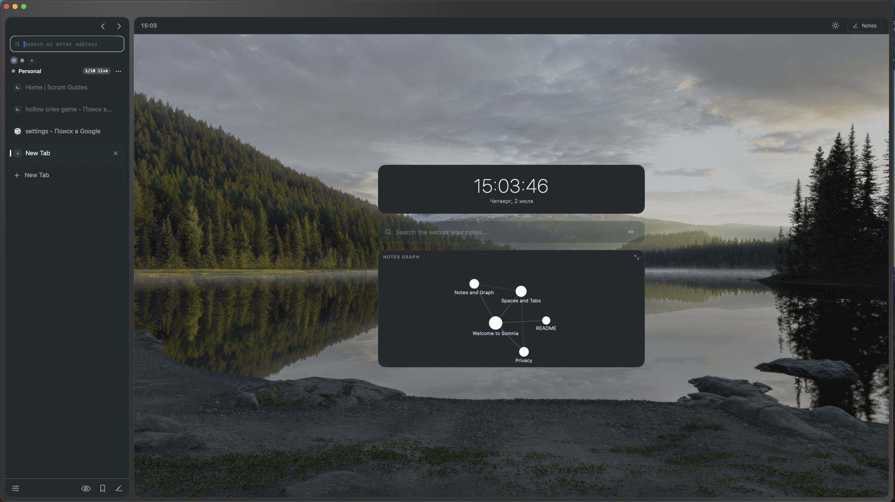
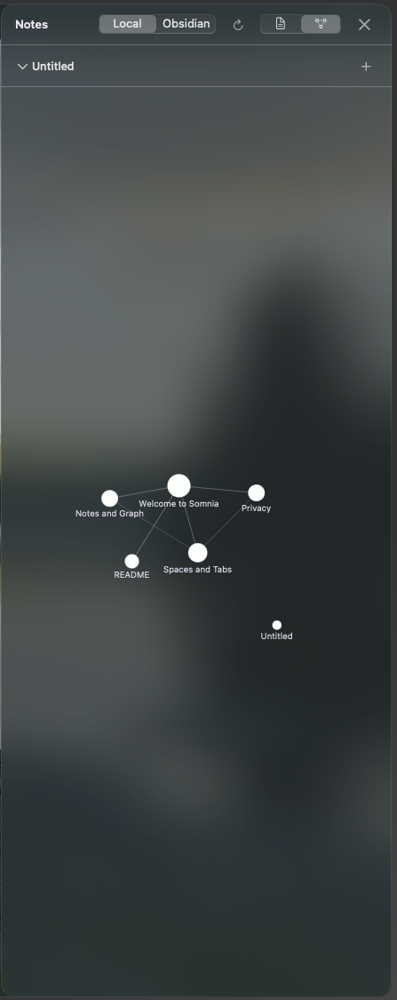
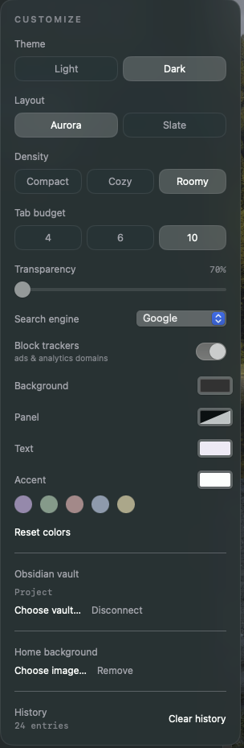

# Somnia 🌙

**A native macOS browser fused with an Obsidian-style notes vault.** Browse the
web on the left, keep linked markdown notes on the right — and see them as a
graph. Built with SwiftUI + WebKit. No Electron, zero external dependencies.


> ⚠️ Personal / early-stage project. It works day to day, but storage formats and
> APIs may still change. Not signed for distribution (see [Gatekeeper](#gatekeeper)).



| Notes graph | Customize |
|:---:|:---:|
|  |  |

## Why Somnia?

Other tools pick a side: **Zen** and **Orion** are browsers; **Obsidian** is
notes. Somnia is both, in one native app — a browser whose second half is a real
linked‑notes vault with a connection graph. If you research on the web and think
in notes, the two live together instead of in separate windows.

## Features

**Browser**
- **Spaces** — group tabs into color‑coded workspaces
- **Light on memory** — tabs load lazily and sleep on an LRU budget; sleeping
  tabs release their web process, and Somnia frees more under system memory pressure
- **Find on page** (⌘F), **history**, **address‑bar autocomplete**, **favicons**,
  **downloads manager** with progress, **configurable search engine**
- **Reader Mode** (⌘⇧R) — a clean, themed reading view
- Vertical, resizable sidebar; Cmd‑click for background tabs; two‑finger back/forward

**Notes (Obsidian‑style)**
- Plain‑markdown vault with `[[wiki‑links]]` and automatic **backlinks**
- Force‑directed **graph** of your notes (and a mini‑graph on the Home screen)
- Connect an external **Obsidian vault** (read‑only)

**Privacy**
- **Tracker / ad blocking** via a native content blocker (toggle in Customize)
- **Private tabs** (⌘⇧N) — no history, no disk cache, excluded from the session
- Local‑first: your notes and history stay on your machine

## Keyboard shortcuts

| Action | Shortcut | Action | Shortcut |
|---|---|---|---|
| New tab | ⌘T | Quick open | ⌘K |
| New private tab | ⌘⇧N | Find on page | ⌘F |
| Close tab | ⌘W | Reader Mode | ⌘⇧R |
| Open file | ⌘O | Open location | ⌘L |
| Reload | ⌘R | Customize | ⌘, |
| Jump to tab | ⌘1–9 | Back / Forward | ⌘[ / ⌘] |

## Build & run

Requirements: **macOS 14+** and **Xcode Command Line Tools** (full Xcode not
required — Somnia builds via `swiftc` directly).

```bash
git clone https://github.com/<you>/somnia.git
cd somnia
./build.sh          # builds Somnia.app with swiftc
open Somnia.app
./test.sh           # pure-logic unit tests (URL resolution, wiki-links, markdown…)
```

### Gatekeeper

The build is ad‑hoc signed, so macOS will warn about an unidentified developer on
first launch. Either **right‑click the app → Open** once, or just build it
yourself with `./build.sh` (recommended).

## Where data lives

Everything is stored under `~/Library/Application Support/Somnia/`:

- `Vault/` — your notes (markdown + YAML frontmatter)
- `session.json` — tabs, spaces, bookmarks
- `settings.json` — theme, search engine, tracker‑blocking toggle
- `history.json`, `favicons/` — browsing history and cached favicons

The `Vault/` folder in this repo contains a few demo notes that seed a new vault
on first build.

## Tech

Swift · SwiftUI · AppKit · WebKit. Single ~2.6 MB binary, no third‑party
dependencies. Architecture and dev notes: [`docs/DEV_NOTES.md`](docs/DEV_NOTES.md).

## License

[MIT](LICENSE) © Andriy Bezditko
